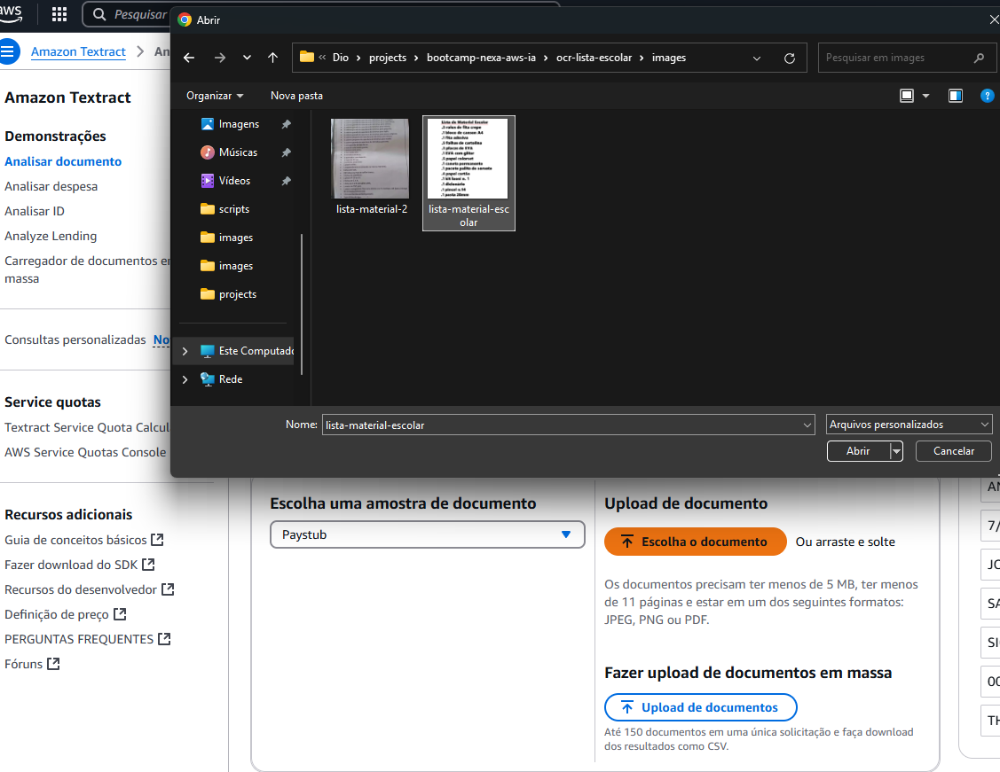
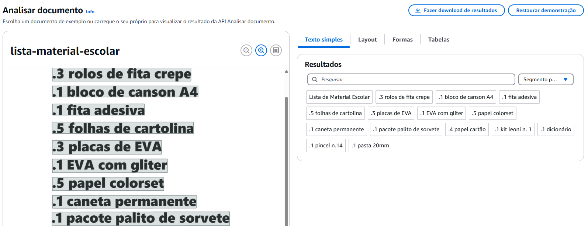

# Amazon Textract: Automatizando a Extração de Dados de Documentos


Amazon Textract é uma poderosa ferramenta de OCR (Reconhecimento Óptico de Caracteres), projetada para transformar documentos não estruturados em dados utilizáveis de forma eficiente. Com esta tecnologia, é possível automatizar processos complexos e integrar dados extraídos diretamente em sistemas de negócios.


### Projeto extração de texto de lista escolar

#### Steps:

1. Por meio do console da AWS utilizei a ferramenta do textract para identificar qual o modelo que melhor se adequava a minha necessidade
    - Acesse o pagina da AWS
    - Faca o Login
    - Busque por textract na barra de pesquisa
    - Na pagina do Textract clique em: Experimento o Amazon Textract
    - Na seção de upload de documento selecione o docuemento que da sua máquina que deseja analisar
         
    
    - Escolha algumas opcoes de saída de dados e clique em aplicar configuracao
    - Analise a melhor opção
        

2. Observei que para caso desse projeto a extração de Raw Text seria a melhor opção, com base nisso pude direcionar minha pesquisa na documentação
    - A documentação pode ser encontrada nesse link: https://docs.aws.amazon.com/pt_br/textract/latest/dg/what-is.html

3. Antes de inicar a codificação eu fiz a configuração do meu ambiente de projeto

   - comandos
    ```python

        Pip install uv

        uv init ocr-lista-escolar

        uv add boto3

        uv add "boto3-stubs[textract]"

        uv venv

        .venv\Scripts\activate 

    ```
    


4. Codificacao
    - importando as bibliotecas
    ```python
        import json #permite manipular os dados no formato JSON.

        from pathlib import Path #usada para manipular caminhos de arquivos e diretórios.

        import boto3 #Importa o SDK boto3, usado para interagir com os serviços da AWS.

        from botocore.exceptions import ClientError #mporta a classe ClientError, utilizada para lidar com erros durante chamadas aos serviços da AWS.

        from mypy_boto3_textract.type_defs import DetectDocumentTextResponseTypeDef
    ```


    - teste
    ```python

        def detect_file_text() -> None:
        client = boto3.client("textract") #Cria um cliente para o serviço Textract da AWS.

        file_path = str(Path(__file__).parent / "images" / "lista-material-2.jpg") #Constrói o caminho completo para o arquivo de imagem
        with open(file_path, "rb") as f:
            document_bytes = f.read() #Abre o arquivo de imagem no modo binário ("rb") e lê seus bytes para serem enviados ao Textract.

        try:
            response = client.detect_document_text(Document={"Bytes": document_bytes}) #Faz uma chamada ao Textract para detectar texto no documento fornecido. Os bytes da imagem são enviados no campo Document
            with open("response.json", "w") as response_file:
                response_file.write(json.dumps(response)) #Salva a resposta JSON em um arquivo chamado response.json.
        except ClientError as e:
            print(f"Erro processando documento: {e}")
    ```

    - teste

    ```python
        def get_lines() -> list[str]: #Responsável por obter as linhas de texto do arquivo de resposta response.json
        try:
            with open("response.json", "r") as f:
                data: DetectDocumentTextResponseTypeDef = json.loads(f.read())
                blocks = data["Blocks"]
            return [block["Text"] for block in blocks if block["BlockType"] == "LINE"]  
            # A resposta do Textract contém um conjunto de "blocos" de dados. Cada bloco pode ser do tipo "LINE", "WORD", etc. 
        
            # Neste projeto apenas os blocos do tipo "LINE" são selecionados, e os textos correspondentes a esses blocos são retornados em uma lista.
        except IOError:
            detect_file_text()
        return []
    ```

    - teste

    ```python
    if __name__ == "__main__":
    for line in get_lines(): #Itera pelas linhas de texto obtidas pela função get_lines()
        print(line) #Imprime cada linha de texto no console.
    
    ```

  
5. Ideias de Melhorias
    - Fazer a busca da imagem em um bucket S3

     ```python

    import json
    import boto3
    from botocore.exceptions import ClientError

    # Função principal que detecta o texto em um documento armazenado no S3.
    def detect_file_text_from_s3(bucket_name: str, file_name: str) -> list[str]:
        # Cria um cliente para o serviço Amazon Textract.
        client = boto3.client("textract")

        # Tenta realizar a operação de extração de texto do documento no S3.
        try:
            # Especifica o bucket e o arquivo no S3 como entrada para o Amazon Textract.
            s3_object = {"S3Object": {"Bucket": bucket_name, "Name": file_name}}
            
            # Chama a API do Textract para detectar texto no documento.
            response = client.detect_document_text(Document=s3_object)

            # Obtém os blocos retornados pela API (dados estruturados do documento).
            blocks = response.get("Blocks", [])
            
            # Filtra e retorna apenas os blocos que representam linhas de texto.
            lines = [block["Text"] for block in blocks if block["BlockType"] == "LINE"]
            return lines
        except ClientError as e:
            # Exibe uma mensagem de erro caso a operação falhe (ex.: permissão ou arquivo inexistente).
            print(f"Erro ao processar documento do S3: {e}")
            return []  # Retorna uma lista vazia em caso de erro.

    # Ponto de entrada do script (executado apenas se o script for chamado diretamente).
    if __name__ == "__main__":
        # Nome do bucket no S3 onde o arquivo está armazenado.
        bucket_name = "" #incluir nome do bucket
        # Nome do arquivo que será processado no bucket do S3.
        file_name = "lista-3.jpeg"

        # Chama a função para extrair o texto do arquivo no S3.
        lines = detect_file_text_from_s3(bucket_name, file_name)
        
        # Verifica se foram extraídas linhas de texto com sucesso.
        if lines:
            print("Linhas extraídas do documento:")
            # Itera sobre as linhas extraídas e as imprime no terminal.
            for line in lines:
                print(line)
        else:
            # Mensagem exibida caso nenhum texto tenha sido extraído ou ocorra um erro.
            print("Nenhuma linha foi extraída ou houve um erro.")

    ```


    - Gerar um arquivo JSON com a impressao formatada

    ```python
        if __name__ == "__main__":
        bucket_name = "" #incluir nome do bucket
        file_name = "lista-material-2.jpg"

        # Busca e imprime as linhas de texto extraídas
        lines = detect_file_text_from_s3(bucket_name, file_name)
        if lines:
            print("Linhas extraídas do documento:")
            for line in lines:
                print(line)
            
            # Criando um dictionary para formatar a response response
            formatted_data = {"lines": lines}
            
            # Escreva a resposata formatada em um JSON file
            with open("formatted_response.json", "w") as json_file:
                json.dump(formatted_data, json_file, indent=4, ensure_ascii=False)  # preservando a formanatcao
            print("\nResposta formatada salva em 'formatted_response.json'.")
        else:
            print("Nenhuma linha foi extraída ou houve um erro.")
    ```

    
    - Criar uma UI onde o usuário possa adicionar a imagem e consiga o retorno em texto


    - Criar uma funcionalidade de traducao da imagem


    - Criar um funcionalidade de leitura do texto extraido